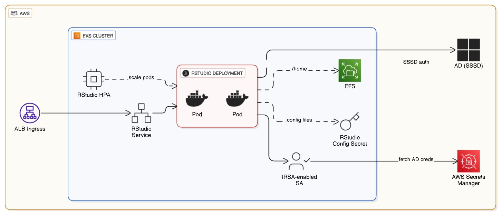
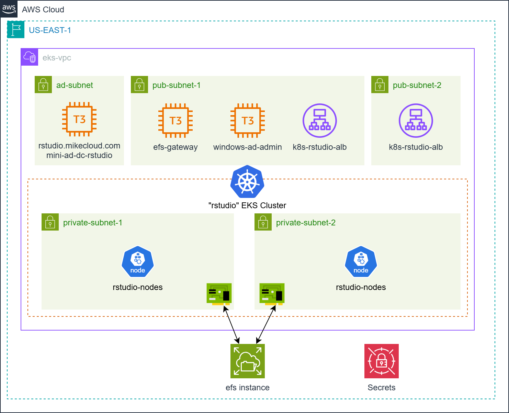

# AWS RStudio Cluster on EKS with Active Directory and EFS Integration

This project builds on both the **AWS Mini Active Directory** and **RStudio on AWS** labs to deliver a **cloud-native, domain-joined RStudio Server cluster** running on **Amazon Elastic Kubernetes Service (EKS)**.  

It uses **Terraform**, **Docker**, and **Kubernetes manifests** to create a fully automated, scalable analytics environment that integrates with **Active Directory authentication** and **Amazon Elastic File System (EFS)** for persistent, shared storage.

Unlike VM-based Auto Scaling Groups, this solution deploys **containerized RStudio Server pods** on EKS that dynamically join the domain and mount **EFS volumes** for user home directories and shared R libraries.  

Key capabilities demonstrated:

1. **EKS-Hosted RStudio Cluster** – RStudio Server (Open Source Edition) runs as containers on an Amazon EKS cluster for elasticity, resilience, and maintainability.  
2. **Active Directory Authentication** – Domain-joined pods authenticate through a Samba-based AD, providing centralized user management.  
3. **EFS-Backed Persistent Storage** – User home directories and shared R package libraries are stored on EFS, ensuring cross-pod consistency and reproducible environments.  
4. **Application Load Balancer (ALB) Ingress** – Provides external HTTPS access with sticky sessions, TLS termination, and DNS integration.  
5. **End-to-End IaC Workflow** – Terraform, Docker, and Helm combine to deliver a modular, reproducible deployment pipeline.

Together, these components form a scalable, domain-aware analytics platform where RStudio users share packages, data, and authentication seamlessly across a fully managed Kubernetes environment.

## Prerequisites

* [An AWS Account](https://aws.amazon.com/console/)
* [Install AWS CLI](https://docs.aws.amazon.com/cli/latest/userguide/getting-started-install.html) 
* [Install Latest Terraform](https://developer.hashicorp.com/terraform/install)
* [Install Docker](https://docs.docker.com/engine/install/)

If this is your first time watching our content, we recommend starting with this video: [AWS + Terraform: Easy Setup](https://youtu.be/BCMQo0CB9wk). It provides a step-by-step guide to properly configure Terraform and the AWS CLI.